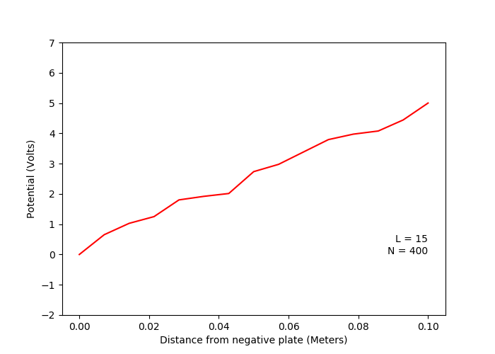
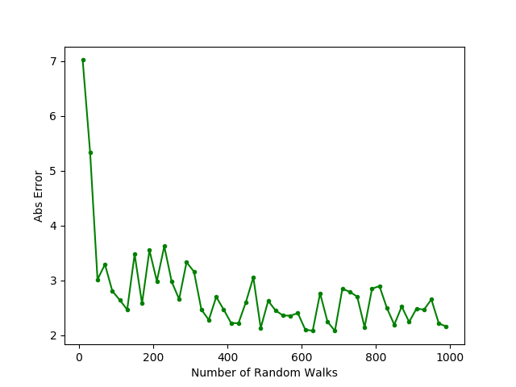
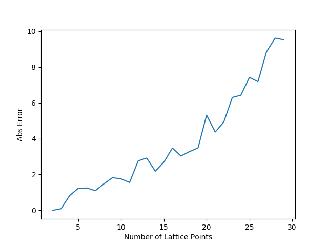
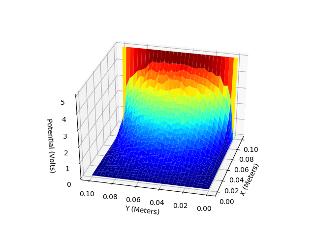
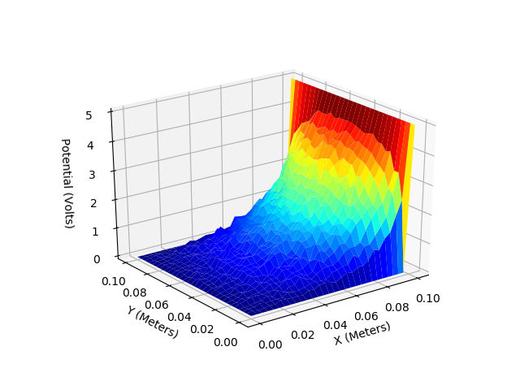
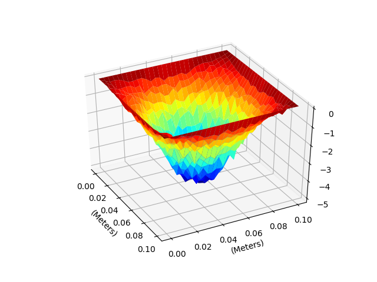
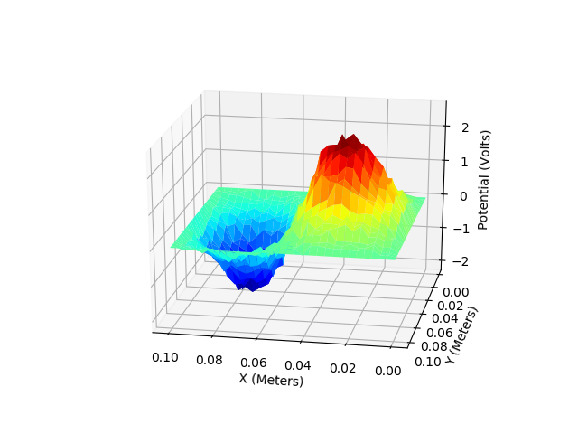
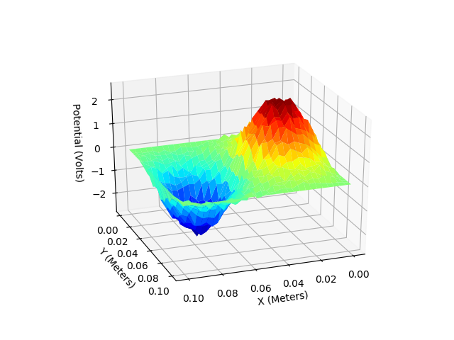
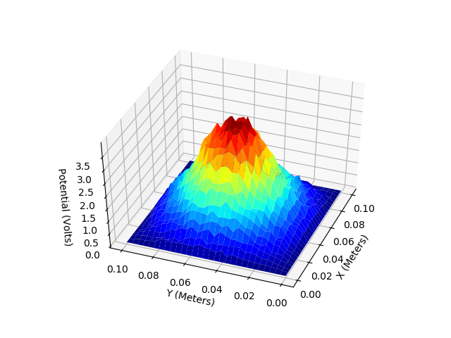
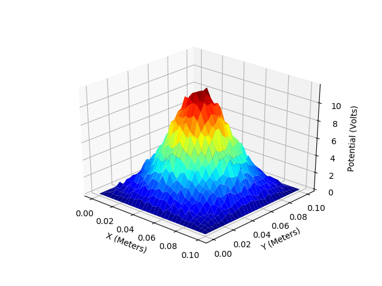

# montecarlo-pde
The Poisson Equation, and its special case, the
Laplace Equation, are important partial differential equations
within electrostatics, as they describe the electric potential field
caused by a particular charge distribution. Solving the Poisson
equation for a given set of boundary conditions is a fundamental
problem within the field. This report describes an algorithm for a
Monte Carlo Method solution to the Poisson and Laplace
equations. Monte Carlo Method is a parallelizable non-
deterministic numerical approach towards solving this problem.
A Python implementation is also provided for three versions of the
Monte Carlo Method: Fixed Step, Semi-Floating and Full
Floating. Several examples including the one-dimensional and
two-dimensional parallel plate capacitors are performed to
illustrate the function of the implementation.

Keywords: Poisson Equation, Laplace Equation, Monte Carlo
Methods, Electrostatics, Parallel Plate Capacitor, Python
Implementation

A. One dimentional capacitor (Laplace Equation)

  
   

B. Variation of solution with number of random walks
(Laplace Equation)

  
   

C. Variation of solution with number of lattice points
(Laplace Equation)

  
   

D.One dimensional capacitor with a linear charge
distribution (Poisson Equation)

  

E. Two dimentional capacitor (Laplace Equation)

  
   

  
   

F.Two dimentional metal box with a spherical charge in
centre (Poisson Equation)

  
   
   

G. Two dimentional metal box with a two oppositely charged
spheres (Poisson Equation)

  
   

  
   

H.Two dimentional metal box with a spherical charge at
center using semi-floating random walk algorithm
(Poisson Equation)

  
   

I. Two dimentional metal box with a spherical charge at
center using full floating random walk algorithm (Poisson
Equation)

  

