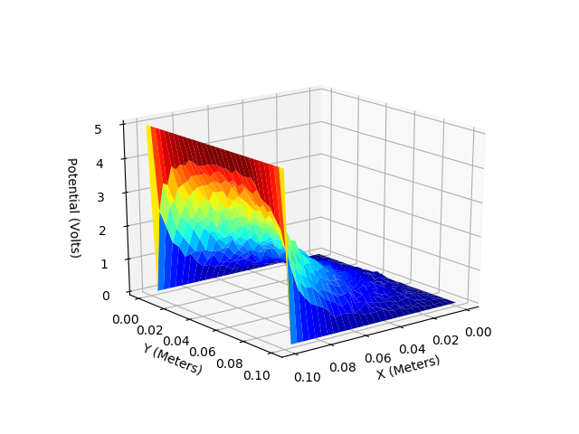
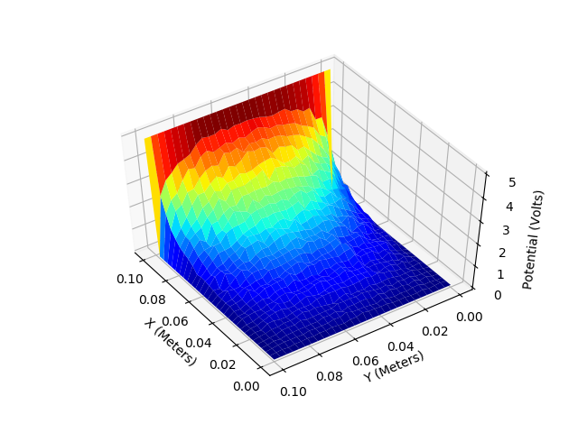
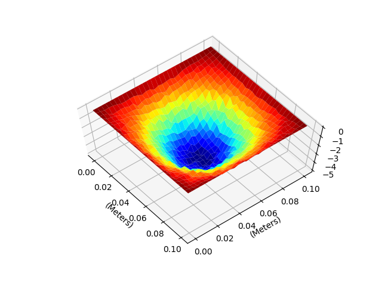
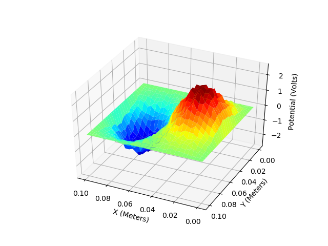

# montecarlo-pde
Monte Carlo Method to Solve Laplace and Poisson Equations with 3 Examples.

1. One Dimentional Capacitor 

2. Two Dimentional Capacitor

  
   
  

3. Metal Box with negatively charged sphere inside

  
   
  

4.  Metal Box with two opposite charged sphere inside

  
   
  

